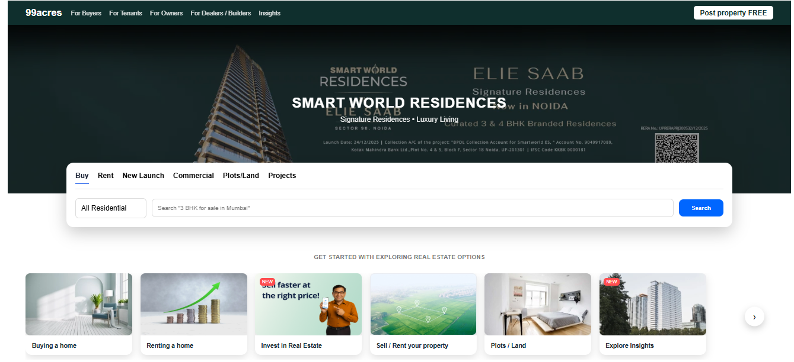
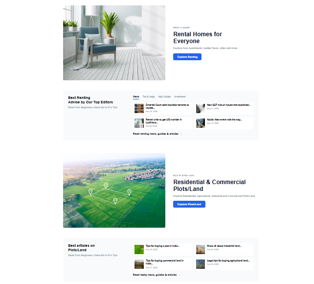
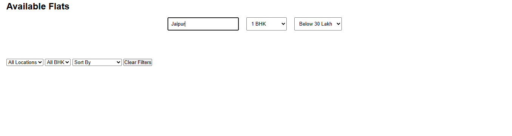

# RealEstate Web

A responsive real estate listing website inspired by 99acres, designed to provide a modern property browsing experience with search, filtering, and sorting functionalities.

## 🚀 Live Demo
(Add your live website link here)

---

## 📸 Screenshots

### Homepage

### Property Listings

### Property Details Modal

---

## 🛠️ Technologies Used
- HTML5
- CSS3
- JavaScript

---

## ✨ Features
- Property listings with images and pricing
- Search properties by location
- Filter properties by BHK type
- Sort properties by price
- Modal popup for detailed property information
- Responsive and user-friendly layout
- Modern real estate UI design

---

## 📂 Project Purpose
This project was created to practice frontend web development concepts including responsive layouts, dynamic filtering, sorting functionality, and interactive UI components.

---

## ⚠️ Current Limitations
- Uses static dummy property data
- No backend or database integration
- No real-time property updates

---

## 🚀 Future Improvements
- Backend API integration
- User authentication system
- Property pagination
- Wishlist / Favorites feature
- Advanced filtering options
- Admin dashboard for property management

---

## 👨‍💻 Author
Rohit Sahu
